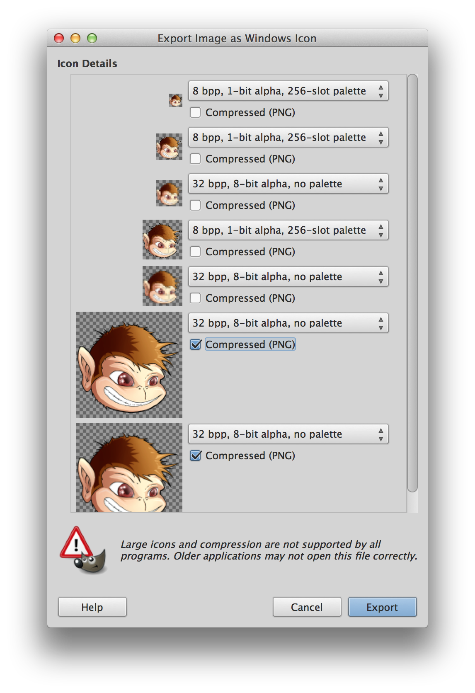

## What does this folder do?
This folder is no common `resources/` folder as in it’d be processed by the build process.  
This is just for the sole purpose of storing the downsampled icons and other resources so you don’t have to create them all over again.  

### HOW TO properly generate Icons
The process of generating icons shouldn't be necessary at all but who knows what the future brings.  
You basically have one large file (256x256px) with 32bit color-depth and have to downsample that to say 128, 48, 32 and 16px.   

Windows Icons contain multiple images with different resolutions to pick them based on the platform.  
I included a GIMP project file, however feel free to use what Software you'd use.  

Essentially you have to create different layers and then the GIMP Exporter (Export -> Windows Icon) does all the work for you.  
See here for the correct configuration:  

### HOW TO Replace Icons:
When a new Netbeans version is out you might need to redo this process since we override netbeans' launcher files with our version (and this launcher can change with a new Netbeans version).  
See `harness-override/README.md` for more information on that subject.  

Open up `app.exe`, `app64.exe` and `pre7_app.exe` (_not_ `pre7_app_w.exe`_!!_) with the `Resource Hacker` Software (or comparable).  
Open up the `Icon Group (100: 1033)` and Rightclick on it to select `Replace Icon`.  
Select `jmonkeyplatform.ico` and you’re done. (Well, save the file ;))  

Note: Your Windows System has an Icon Cache so you can’t see that it actually worked.   
Simply launch `ie4uinit.exe -ClearIconCache` and you should see the differences.  

[There’s](http://www.sevenforums.com/tutorials/49819-icon-cache-rebuild.html) a larger tutorial but it shouldn’t be necessary.  

When you’ve changed the icon, make sure to change the hashes in `harness-override/override.properties`.  
You have the „hashBefore“ and „hashAfter“.  
The first one is the plain `.exe` before changing (This is so we can see if there’s a new NetBeans version without us having changed the icons/exe) and the other one is after changing. Simple, huh?  

Then issue `shasum -a 256 netbeans/harness/launchers/*.exe` so you have all the hashBefore’s / After’s  
See `harness-override/README.md` for more information on that subject.

### HOW TO Replace About/Splash Screen:
The About Screen is currently just the same as the Splash Screen but downsampled:  
It's currently 432 × 302 Pixels but that's just something I found on the net.  
It's simply like this: Once your resolution is too large (like the 500x350px of our Splash Screen), some additional ugly scroll bars will appear and the window won't be enlarged. Since there is no easy (and reasonable) way to use your own About Screen, we will simply stick to this.  
Just place the `about.png` and the `splash.gif` (though animation doesn't seem to be supported out of the box) inside `branding/core/core.jar/org/netbeans/core/startup/`. There you will also find the `Bundle.properties` which is responsible for the SDK Naming and the Splash Settings (Width, Height, Colors)  

In `branding/modules/org-netbeans-core.jar/org/netbeans/core/ui/Bundle.properties` you will find the stuff needed to adjust the About Dialog (the html code displayed)